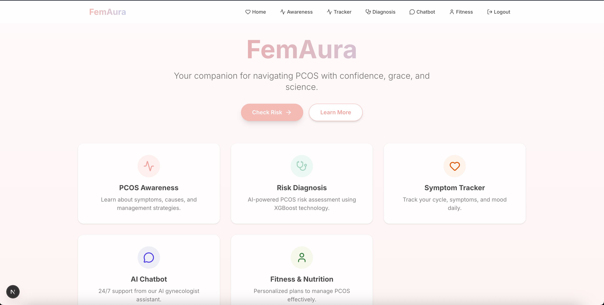
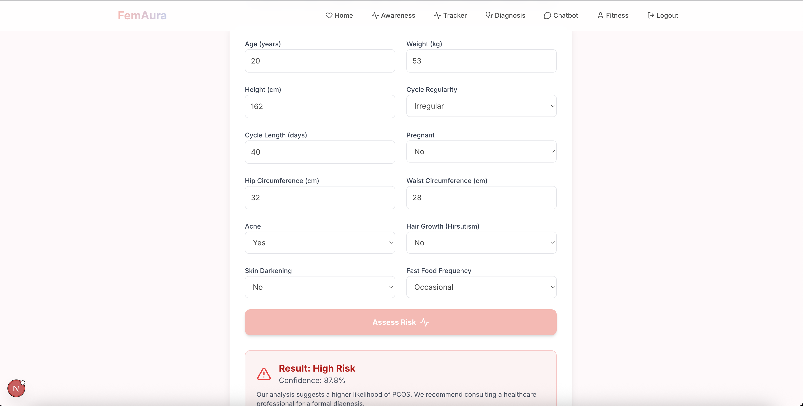
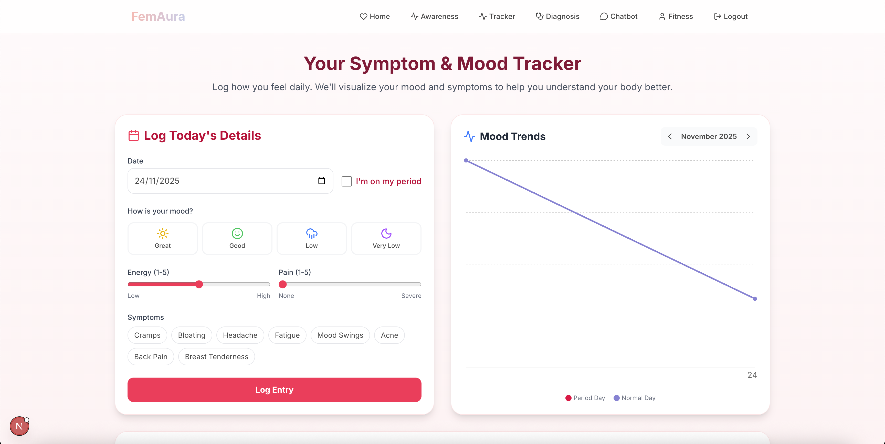
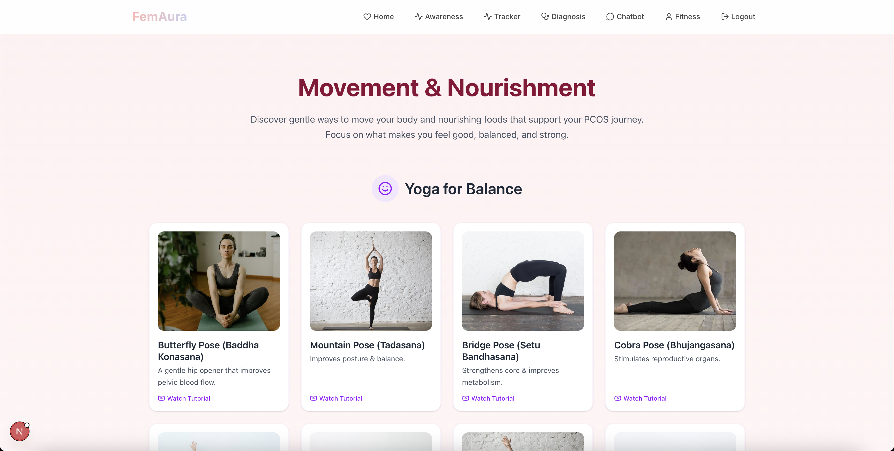
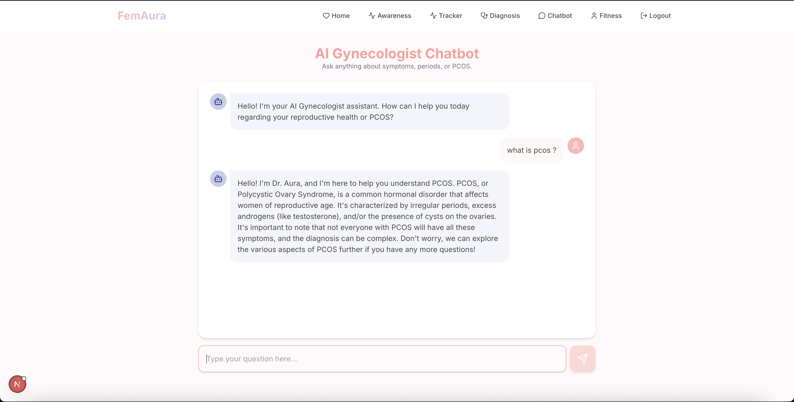

# 🛡️ FemAura - Balance within, Wellness beyond
### "Empowering women with PCOS through awareness and detection, personalized health tracking, and holistic well-being solutions."

* What is PCOS(Polycystic Ovarian Syndrome)?
* Features
* PCOS Detection 
* Tech Stack we used 
* Glimpse of Project
* Future Plans for Project  
* Team Members

# 🩺 What is PCOS (Polycystic Ovarian Syndrome)? 
> "One in five(20%) Indian women suffers from PCOS" ~ The Hindu.
* PCOS (Polycystic Ovary Syndrome) is a hormonal disorder affecting women of reproductive age.
* It involves small ovarian cysts, hormonal imbalances, and excess androgens.
* Common symptoms include irregular periods, excessive hair growth, acne, and weight gain.
* Insulin resistance also contributes to its development.

> PCOS is the leading cause of infertility in women.
* In India, the incidence of PCOS is higher among urban women than rural women.
* Liestyle changes, such as a healthy diet and regular exercise, can help manage PCOS symptoms.
> while there is no cure for PCOS, early diagnosis and management can improve quality of life and prevent long-term health complications such as diabetes and heart disease.

# 🌟 Features:
* **PCOS Detection**: ML model analyzes user input to assess PCOS risk.

* **Symptom Tracking**: Monitor PCOS-related symptoms to identify health patterns early.

* **Gynecologist AI Bot**: Chatbot offering gynecological advice, answers, and emotional support.

* **Personalized Fitness & Nutrition**: Customized fitness and diet plans for a healthier lifestyle.

# 🛠️ Tech Stack:
* Machine Learning-
  * Python: Pandas, Numpy, Sklearn, uvicorn
  * Model: XG Boost + SMOTE
* Frontend-
  * HTML
  * CSS
  * JavaScript
  * React
* Backend-
  * Node.js
  * Express.js
  * JWT
  * MongoDB

# 📸 Glimpse of Project:

# 🚀 Future Vision of the Project:
* **Improved Accuracy**: Incorporate advanced ensemble trained models and larger, diverse datasets.
* **Mobile App Integration**: Enable real-time tracking and easier access to the users via smartphones.
* **SHAP Explainability**: Help users understand model decisions clearly for transparency and trust. 

# 👩‍💻 Team Members

| Name | GitHub Profile |
|:----:|:--------------:|
| Divyansh Trivedi | [@divyansh-trivedi](https://github.com/divyansh-trivedi) |
| Aadvi Singh | [@aadvisingh04](https://github.com/aadvisingh04) |
| Khushi Singh  | [@Khushi-Singh25](https://github.com/Khushi-Singh25) |
